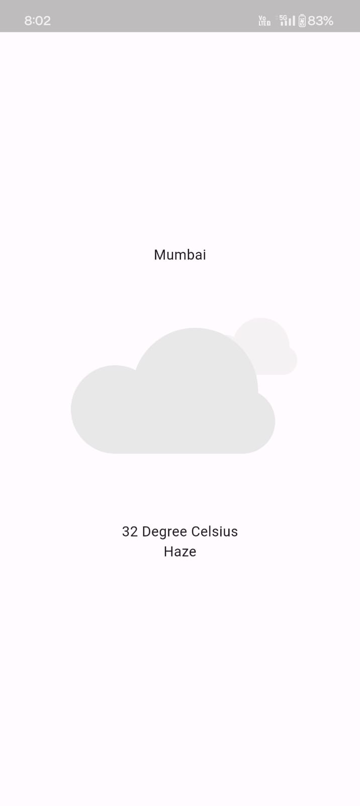

# weather-app
A simple weather app made with flutter using OpenWeather API. It takes your current location and displays the temperature, city and weather condition according to it. It also displays an apprpriate animation according to the weather condition.

Main Page
